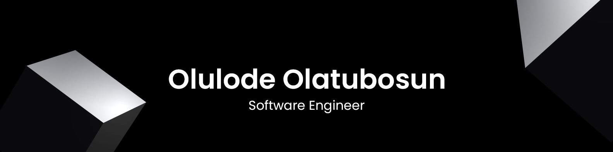

### Hi there 

 

---

## 👋 About Me  

Hello! I am **Olatunbosun Olulode**, a passionate **Fullstack Software Engineer** with a strong focus on backend development. With over **7 years of development experience**, including **3+ years of professional expertise**, I have worked extensively with startups to deliver impactful and scalable solutions.  

### 🌟 Professional Highlights  
- 🏗️ Led the development of [**A1Tutor**](https://a1tutor.org) and [**MyAdmissionLink**](https://myadmissionlink.com), bringing them from local concepts to production in collaboration with other engineers.
- 🌍 One of the early engineers at [**Termii Group**](termii.com), contributing to key backend development initiatives.  
- 🚀 Worked as a **Backend Engineer** with **Shareqaure.co**, building scalable backend systems.
- 👨‍🏫 Mentored students like **Oluwatoyin Akinbobola** ([LinkedIn Profile](https://www.linkedin.com/in/oluwatoyin-akinbobola-48594522b/)) into becoming successful software engineers.  
- 🌍 Currently pursuing a **Master’s degree in Software Engineering and Digital Transformation** in France.  

I aspire to become a **Technical Project Manager** and a **Leading Tech Consultant** in the near future.  

  

---

### 🎯 Skills and Expertise  
---

#### 💻 **Programming Languages**

      

#### 🗃️ **Databases**  

         

#### 🚀 **Frameworks and Libraries**  

        

#### 🛠️ **Tools and Platforms**  
 

  

#### 🪡 **IDEs/Editors**

---

### 🎯 Career Goals  

- 🌱 Currently enhancing my expertise in **Digital Transformation** and **Software Engineering**.  
- 🏆 Aspiring to lead **Technical Projects** and provide **Consulting Solutions** globally.  
- 💡 Exploring innovative solutions in backend systems and scalable architectures.  

---

### 📊 GitHub Stats  

    
  
  

---

### 🌐 Socials  

Feel free to connect with me:  
- [LinkedIn](https://www.linkedin.com/in/olulode-olatunbosun/)  
- [Twitter](https://twitter.com/olaolulode)  

---
<!-- 
<picture>
  <source media="(prefers-color-scheme: dark)" srcset="https://raw.githubusercontent.com/horlathunbhosun/horlathunbhosun/output/github-contribution-grid-snake-dark.svg">
  <source media="(prefers-color-scheme: light)" srcset="https://raw.githubusercontent.com/horlathunbhosun/horlathunbhosun/output/github-contribution-grid-snake.svg">
  
</picture>

## Stats
<!-- 

-->

<!-- 
<picture>

&nbsp;

 <source media="(prefers-color-scheme: dark)" srcset="https://raw.githubusercontent.com/ayoayomide/ayoayomide/output/github-contribution-grid-snake-dark.svg">
  <source media="(prefers-color-scheme: light)" srcset="https://raw.githubusercontent.com/ayoayomide/ayoayomide/output/github-contribution-grid-snake.svg">
  
</picture>
-->
